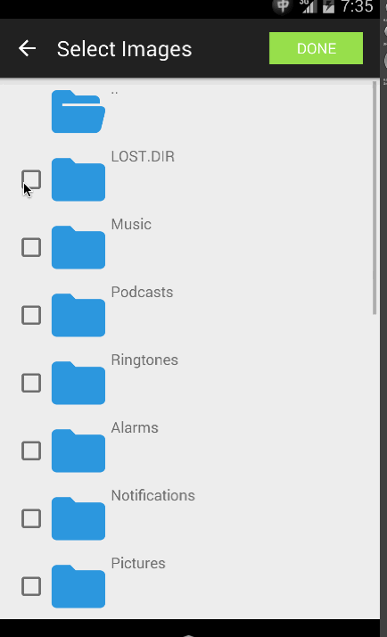

#FileChooser
FileChooser is a file picker module for android developers.

##Project Status
Almost there.
##Project Structure
The whole project is a test project. 

The module is located in `filechooser` folder.

FileChooser module contains an file chooser activity which can select multipule files and return the result after the activity is finished.
##Usage
* To start file chooser activity, use below code.

		Intent intent = new Intent();
		intent.setAction("sun.bob.open_filechooser");
        startActivityForResult(intent, 0);
        
* To get result from FileChooserActivity, use below sample to code your `onActivityResult` method.

		@Override
    	public void onActivityResult(int requestCode, int resultCode, Intent data){
        	if (resultCode == RESULT_OK){
            	 ArrayList files = data.getStringArrayListExtra("files");
	        }
    	}

##Screenshot
